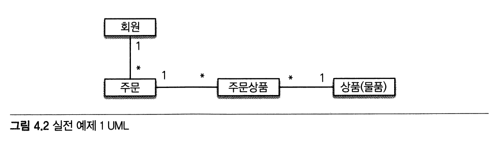
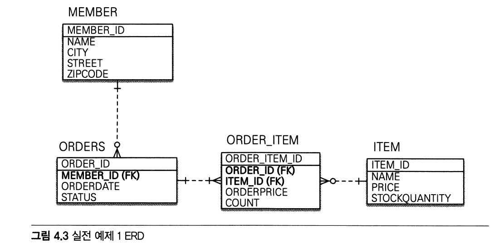
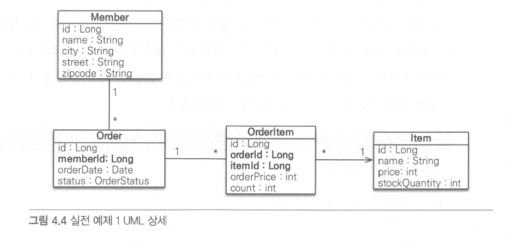
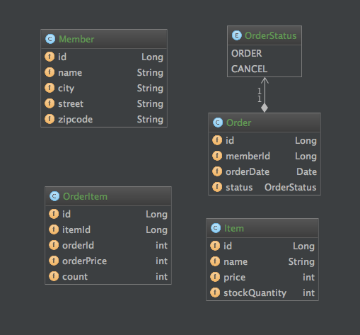

### 도메인 모델 분석

**회원과 주문의 관계**

* 회원은 여러 번 주문할 수 있으므로 회원과 주문은 일대다 관계다

**주문과 상품의 관계**

* 주문할 때 여러 상품을 선택할 수 있고, 같은 상품도 여러 번 주문될 수 있으므로 둘은 다대다 관계다.
* 하지만 이런 다대다 관계형 데이터베이스는 물론이고 엔티티에서도 거의 사용하지 않는다.
* 따라서 주문 상품이라는 연결 엔티티를 추가해서 다대다 관계를 일대다, 다대일 관계로 풀어냈다.
* 주문 상품에는 해당 상품을 구매한 금액과 수량 정보가 포함되어 있다.

---

### 테이블 설계

* 회원(MEMBER)
  * 이름(NAME)
  * 주소
    * CITY, STREET, ZIPCODE 로 표현
  
* 주문(ORDERS)
  * 상품을 주문한 회원(MEMBER_ID)
    * 외래 키로 가짐
  * 주문 날짜(ORDER_DATE)
  * 주문 상태(STATUS)
    * 주문(ORDER)과 취소(CANCEL)를 표현
  
* 주문 상품(ORDER_ITEM)
  * 주문(ORDER_ID)
    * 외래 키
  * 주문한 상품(ITEM_ID)
    * 외래 키
  * 주문 금액(ORDER_PRICE)
  * 주문 수량(COUNT)
  
* 상품(ITEM)
  * 이름(NAME)
  * 가격(PRICE)
  * 재고수량(STOCKQUANTITY)

---

### 엔티티 설계와 매핑

* 아래 그림은 설계한 테이블을 기반으로 실제 엔티티를 설계한 UML이다
  
  

* 실제 코드로 만들어진 UML

  

---

### 데이터 중심 설계

* 이 예제의 엔티티 설계가 이상하다는 생각이 들었다면 객체지향 설계를 의식하는 개발자일 것이고 자연스러웠다면 데이터 중심의 개발자일 것이다
* 객체지향 설계는 각각의 객체가 맡은 역할과 책임이 있고 관련 있는 객체끼리 참조하도록 설계해야 한다
* 이 예제의 방식은 테이블 설계에 맞춘 방법이다

**문제점**

* 테이블의 외래키를 객체에 그대로 가져온 부분이 문제이다
  * 관계형 데이터베이스는 연관된 객체를 찾을 때 외래 키를 사용해서 조인하면 됨
  * 그러나 객체는 조인이라는 기능이 없고 참조를 사용함
* 설계한 엔티티로 데이터베이스 스키마 자동 생성하기를 실행해보면 ERD에 나온대로 테이블이 생성됨
* 하지만 객체에서 참조 대신에 데이터베이스의 외래 키를 그대로 가지고 있으므로 order.getMember() 처럼 객체 그래프를 탐색할 수 없고 객체의 특성도 살릴 수 없음
* 객체가 다른 객체를 참조하지도 않으므로 UML도 잘못되었음
* 객체는 외래키 대신에 참조를 사용해야 함
