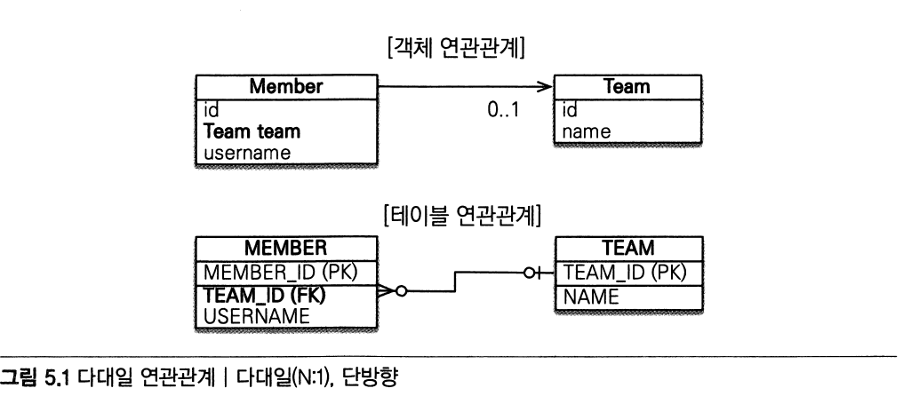
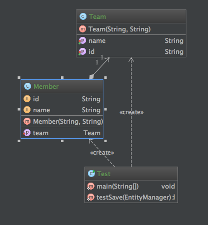
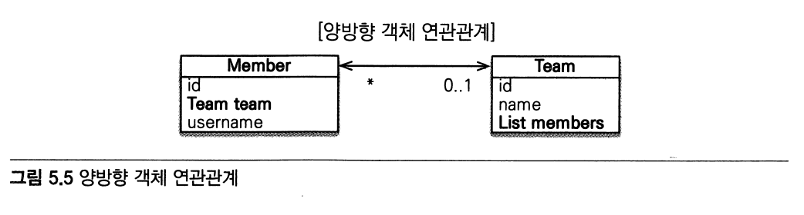
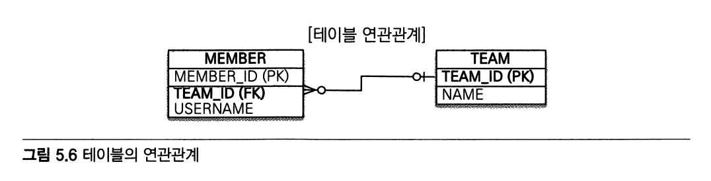
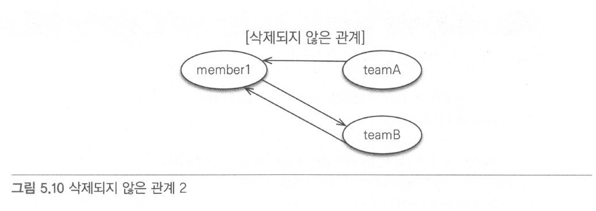

## 연관관계 매핑 기초

### 단방향 연관관계

#### 다대일(N:1)

**예제**

* 회원과 팀이 있다
* 회원은 하나의 팀에만 소속될 수 있다
* 회원과 팀은 다대일 관계다
* 
  
---

**객체 연관관계**

* 회원 객체는 Member.team 필드(멤버 변수)로 팀 객체와 연관관계를 맺음
* 회원 객체와 팀 객체는 **단방향 관계**다
  * 회원은 member.getTeam()으로 조회 가능하지만 팀은 member 에 접근하는 필드는 없음

**테이블 연관관계**

* 회원 테이블은 TEAM_ID 외래 키로 테이블과 연관관계를 맺음
* 회원 테이블과 팀 테이블은 **양방향 관계**다
  * 회원 테이블의 TEAM_ID 외래 키를 통해서 회원과 팀을 조인할 수 있고 반대로 팀과 회원도 조인할 수 있음
  * MEMBER JOIN TEAM / TEAM JOIN MEMBER 둘다 가능

**객체 연관관계와 테이블 연견관계의 가장 큰 차이**

* 참조를 통한 연관관계는 언제나 단방향이다. 
  객체간에 연관관계를 양방향으로 만들고 싶으면 반대쪽에도 필드를 추가해서 참조를 보관해야 한다. 
  즉 연관관계를 하나 더 만들어야 함
  양쪽에서 서로 참조하는 것을 양방향 연관관계라 하지만 정확하게 이야기하면 서로 다른 단방향 관계 2개다

---

**객체 그래프 탐색**

* 객체는 참조를 사용해서 연관관계를 탐색하는데 이것을 객체 그래프 탐색이라 함

---

* 실제 코드로 만들어진 UML

  

---

#### 양방향 연관관계

**양방향 객체 연관 관계**
  
  
  
**테이블 연관관계**

  
  
**객체의 양방향 연관관계는 양쪽 모두 관계를 맺어주어야 함**

* 양방향 연관관계 코드

  ```java
  member.setTeam(team)
  team.getMembers().add(memeber);
  ```
  
* 편의 메소드

  ```java
  public void setTeam(Team team) {
    this.team = team;
    team.getMembers().add(this);
  }
  ```

**연관관계 편의 메소드 작성 시 주의사항**

* 팀 변경시 기존의 관계를 제거하지 않았다
* 연관관계를 변경할 때는 기존 팀이 있으면 기존 팀과 회원의 연관관계를 삭제하는 코드를 추가해야 함

* 코드

  ```java
  member1.setTeam(teamA);
  member1.setTeam(teamB);
  Member findMember = teamA.getMember();  // memeber1 이 여전히 조회됨
  ```

* 삭제되지 않은 관계 1

  

* 삭제되지 않은 관계 2

  

**장점**

  * 단방향과 비교해서 반대방향으로 객체 그래프 탐색 기능이 추가된 것임
  
---

**요약**

* 단방향 매핑만으로 테이블과 객체의 연관관계 매핑은 완료
* 단방향을 양방향으로 만들면 반대반향으로 객체 그래프 탐색 기능이 추가
* 양방향 연관관계를 매핑하려면 객체에서 양쪽 방향을 모두 관리해야 함
* 연관관계의 주인을 정하는 기준
  * 외래 키의 위치와 관련해서 정해야지 비지니스 중요로도 접근하면 안됨
  * 일대다를 연관관계의 주인으로 선택해도 됨 그러나 성능과 관리 측면헤서 권장하지 않음
